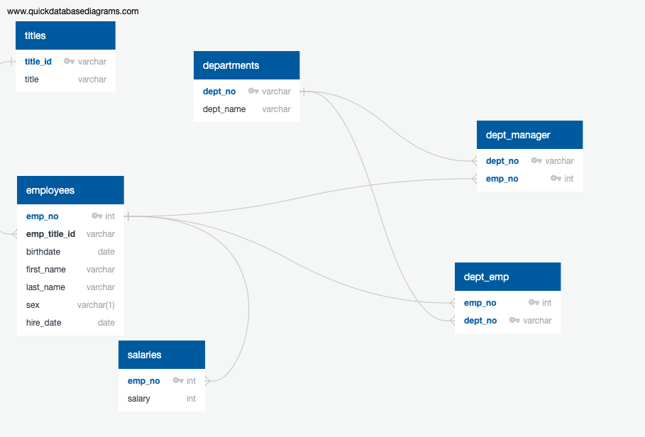
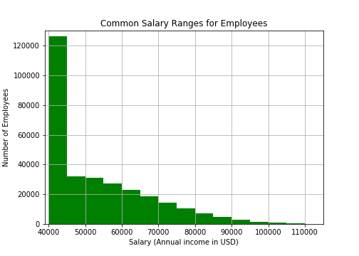

# sql-challenge
Data Engineering and Analysis on Employee Data

This Exercise was created for my Data Analytics Boot Camp SQL Homework.

## Use

### Data Modeling

Entity Relationship Diagram:

### Data Engineering

1. Create PostgreSQL database called "employees_db"

2. Create tables using [/sql/employees_db_tables.sql](/sql/employees_db_tables.sql)

3. Import the data provided in the [/data](/data) directory into the associated tables. In order to load correctly due to foreign key constraints, ideal order of importing data should be: titles, employees, salaries, departments, dept_emp, dept_manager

### Data Analysis

Data requested can be found in [/sql/select_data.sql](/sql/select_data.sql)

#### Bonus Histogram

